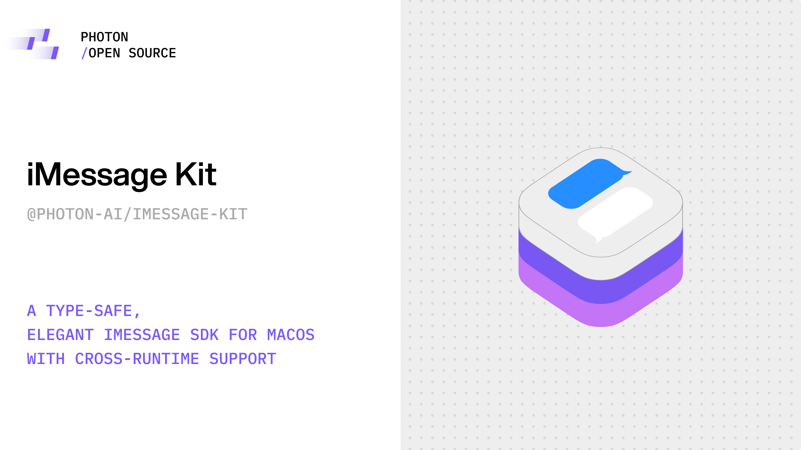
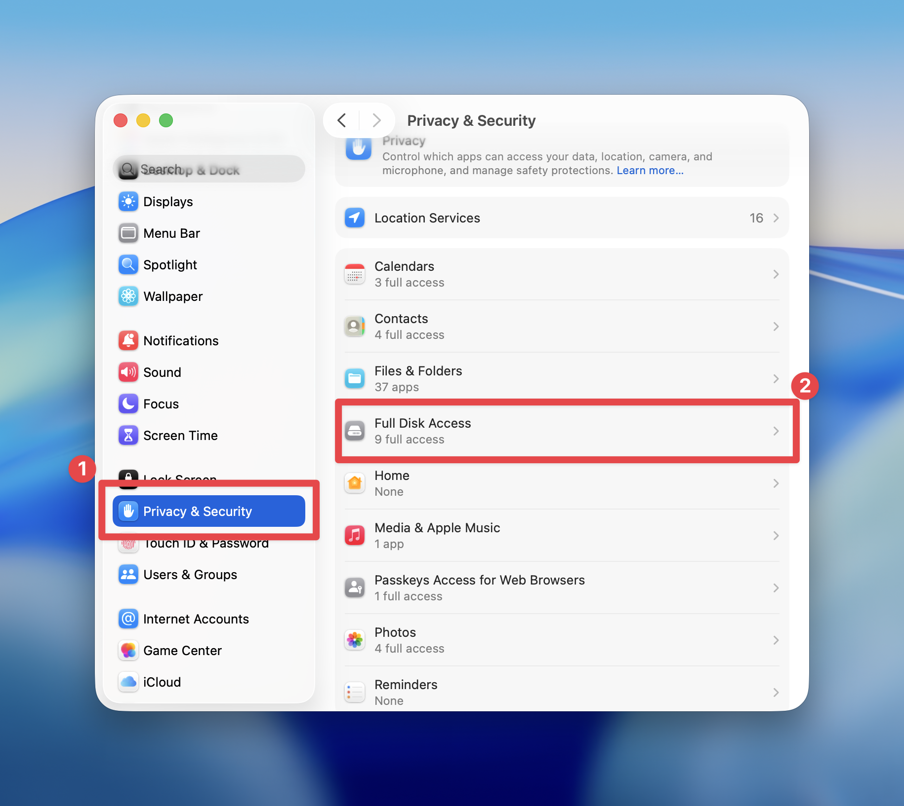
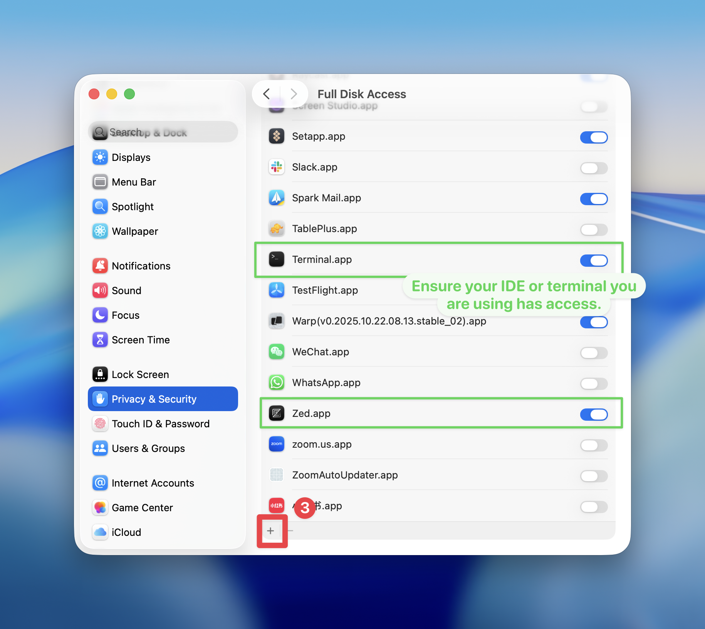

<div align="center">
  


# @photon-ai/imessage-kit

> A type-safe, elegant iMessage SDK for macOS with cross-runtime support

</div>

[](https://www.npmjs.com/package/@photon-ai/imessage-kit)
[](https://www.typescriptlang.org/)
[](./LICENSE)
[](https://discord.gg/RSJUUHTV)

It lets you **read**, **send**, and **automate** iMessage conversations directly from Node.js or Bun.
Built for developers who want to integrate messaging into their **AI agents, automation scripts**, or **chat-first apps**, without AppleScript headaches.

> [!NOTE]
> **✨ Looking for advanced features like threaded replies, tapbacks, message editing, unsending, live typing indicators, and group chats? Or need hosting / enterprise-grade scalability? Check out our [Advanced iMessage Kit](https://github.com/photon-hq/advanced-imessage-kit) and contact us at daniel@something.surf.**

## Features

- **100% Type-safe** - Full TypeScript support with perfect type inference
- **Cross-Runtime** - Supports both Node.js and Bun with automatic runtime detection
- **Smart Database** - Uses native `bun:sqlite` for Bun, `better-sqlite3` for Node.js
- **Read Messages** - Query iMessage, SMS, and RCS messages with powerful filters
- **Send Messages** - Send text, images, and files (PDF, CSV, VCF, etc.)
- **Fluent API** - Elegant message chain processing
- **Real-time Watching** - Monitor new messages with webhook support (works even in Do Not Disturb mode)
- **Plugin System** - Extensible architecture for custom behaviors
- **Performance** - Concurrent message sending with semaphore control
- **Error Handling** - Comprehensive error types and type guards


## Hello, iMessage 
```typescript
import { IMessageSDK } from '@photon-ai/imessage-kit'

const sdk = new IMessageSDK()
await sdk.send('+1234567890', 'Hello from iMessage Kit!')
```


## Installation

```bash
# For Bun (zero dependencies)
bun add @photon-ai/imessage-kit

# For Node.js (requires better-sqlite3)
npm install @photon-ai/imessage-kit better-sqlite3
# or
yarn add @photon-ai/imessage-kit better-sqlite3
```

## Granting Permission

`IMessageKit` requires **Full Disk Access** to read your chat history and perform automation tasks.

Before starting, make sure to grant the necessary permissions to the IDE or terminal where you plan to run the program:

1. Open **System Settings → Privacy & Security → Full Disk Access**.
2. Click the **“+”** button and **add** the IDE or terminal you are using.

In the example below, access has been granted to **Zed** and **Terminal**, allowing `IMessageKit` to function properly with both.

If you use other tools such as **Cursor**, **VS Code**, or **Warp**, make sure to grant them permission as well.

<p align="center">
  
  
</p>


## Quick Start

```typescript
import { IMessageSDK } from '@photon-ai/imessage-kit'

// Initialize SDK (works in both Node.js and Bun)
const sdk = new IMessageSDK({
    debug: true,
    maxConcurrent: 5
})

// Get unread messages
const unreadMessages = await sdk.getUnreadMessages()
for (const { sender, messages } of unreadMessages) {
    console.log(`${sender}: ${messages.length} unread messages`)
}

// Send messages (unified API)
await sdk.send('+1234567890', 'Hello!')
await sdk.send('+1234567890', { images: ['photo.jpg'] })
await sdk.send('+1234567890', { files: ['document.pdf', 'contact.vcf'] })
await sdk.send('+1234567890', { text: 'Check this out', images: ['photo.jpg'], files: ['data.csv'] })

// Always close when done
await sdk.close()
```

## Core APIs

### Reading Messages

```typescript
// Get messages (excludes your own by default)
const result = await sdk.getMessages()

// Filter messages
const filtered = await sdk.getMessages({
    sender: '+1234567890',
    unreadOnly: true,
    limit: 20,
    since: new Date('2025-10-20')
})

// Include your own messages
const all = await sdk.getMessages({ excludeOwnMessages: false })

// Get unread messages grouped by sender
const unread = await sdk.getUnreadMessages()
```

### Sending Messages

```typescript
// Unified send API
await sdk.send(recipient, content)

// Send text only
await sdk.send('+1234567890', 'Hello World!')

// Send images only
await sdk.send('+1234567890', { 
    images: ['image1.jpg', 'image2.png'] 
})

// Send files (PDF, CSV, VCF, etc.)
await sdk.send('+1234567890', { 
    files: ['document.pdf', 'data.csv', 'contact.vcf'] 
})

// Send text with images and files
await sdk.send('+1234567890', { 
    text: 'Check these files',
    images: ['photo.jpg'],
    files: ['report.pdf']
})

// Send network images (auto-download)
await sdk.send('+1234567890', { 
    images: ['https://example.com/image.jpg'] 
})

// Convenience methods for files
await sdk.sendFile('+1234567890', '/path/to/document.pdf')
await sdk.sendFile('+1234567890', '/path/to/contact.vcf', 'Here is the contact')
await sdk.sendFiles('+1234567890', ['file1.pdf', 'file2.csv'], 'Multiple files')

// Batch sending
await sdk.sendBatch([
    { to: '+1111111111', content: 'Message 1' },
    { to: '+2222222222', content: { text: 'Message 2', images: ['img.jpg'] } },
    { to: '+3333333333', content: { files: ['document.pdf'] } }
])

// Send to a chat by chatId (group or DM)
// Group chatId uses GUID (no service prefix)
await sdk.sendToChat('chat45e2b868ce1e43da89af262922733382', 'Hello group!')
await sdk.sendFileToChat('chat45e2b868ce1e43da89af262922733382', '/path/to/report.pdf')
await sdk.sendFilesToChat('chat45e2b868ce1e43da89af262922733382', ['/file1.pdf', '/file2.csv'], 'Docs attached')
// DM chatId format and auto-conversion
// You can still call sdk.send('+1234567890', 'Hello'), which internally
// converts to the chatId "iMessage;+1234567890" and sends via chat.
// For email DM: sdk.send('user@example.com', 'Hello') -> "iMessage;user@example.com"

### Listing Chats

`listChats()` returns both group and direct chats, providing a stable routing key `chatId`:

- Group: `chatId = chat.guid` (stable GUID, recommended for all group routing)
- Direct (DM): `chatId = "<service>;<address>"` (for example `iMessage;+1234567890` or `SMS;+1234567890`)

```typescript
const chats = await sdk.listChats(50) // optional limit
for (const c of chats) {
  // Use chatId directly for routing, no need to resolve by name or messages
  console.log({ chatId: c.chatId, name: c.displayName, last: c.lastMessageAt, isGroup: c.isGroup })
}
```

Note: `sendToChat(chatId, ...)` accepts both formats above. Also, `sdk.send('+1234567890', 'Hello')` is automatically converted to the DM chatId `iMessage;+1234567890` and sent through the unified chat flow.
```

### Message Chain Processing

The SDK provides a fluent API for elegant message processing:

```typescript
// Basic chain processing
await sdk.message(msg)
    .matchText(/hello/i)
    .replyText('Hi there!')
    .execute()

// Complex conditions
await sdk.message(msg)
    .ifUnread()
    .when(m => m.sender.startsWith('+1'))
    .replyText('Received!')
    .execute()

// Reply with images
await sdk.message(msg)
    .matchText('photo')
    .replyImage(['photo.jpg', 'photo2.jpg'])
    .execute()

// Group chat only
await sdk.message(msg)
    .ifGroupChat()
    .replyText('Group reply!')
    .execute()
```
Note: Replies in the chain always target `message.chatId` (supports both DM and group).

### Real-time Message Watching

```typescript
// Configure watcher
const sdk = new IMessageSDK({
    watcher: {
        pollInterval: 3000,        // Check interval (default: 2000ms)
        unreadOnly: false,         // Watch all messages (default: false)
        excludeOwnMessages: true   // Exclude own messages (default: true)
    }
})

// Start watching
await sdk.startWatching({
    onNewMessage: async (message) => {
        await sdk.message(message)
            .replyText('Thanks!')
            .execute()
    },
    
    onGroupMessage: async (message) => {
        console.log('Group:', message.chatId)
    },
    
    onError: (error) => {
        console.error('Error:', error)
    }
})

sdk.stopWatching()
```

### Webhook Integration

```typescript
const sdk = new IMessageSDK({
    webhook: {
        url: 'https://your-server.com/webhook',
        headers: { 'Authorization': 'Bearer token' }
    }
})

await sdk.startWatching()
// Webhook receives: { event, message, timestamp }
```

## Plugin System

Extend SDK functionality with plugins:

```typescript
import { loggerPlugin } from '@photon-ai/imessage-kit'

// Use built-in logger plugin
sdk.use(loggerPlugin({
    level: 'info',
    prefix: '[iMessage]'
}))

// Create custom plugin
const customPlugin = {
    name: 'my-plugin',
    onInit: async () => {
        console.log('Plugin initialized')
    },
    onBeforeSend: async (to, content) => {
        console.log('Sending to:', to)
        return { to, content }
    },
    onAfterSend: async (result) => {
        console.log('Send result:', result)
    },
    onDestroy: async () => {
        console.log('Plugin destroyed')
    }
}

sdk.use(customPlugin)
```

### Group Chat ChatId: How to Find and Use

Find the `chatId` for a group chat first, then use it to send messages reliably.

1) Find Group ChatId (no database permission required)

- Use the AppleScript helper example to list chats and GUIDs:

```bash
# List all chats (filters groups only)
GROUPS_ONLY=true bun run examples/list-chats-applescript.ts

# Filter by name keyword (case-insensitive)
GROUPS_ONLY=true Q="project" bun run examples/list-chats-applescript.ts
```

This produces lines like:

```
chatId=iMessage;+;chat61321855167474084 | name=Project Team | type=GROUP
```

2) Find Group ChatId (requires Full Disk Access)

- If you prefer a database-backed list with `lastMessageAt` and `displayName`, call `listChats()` or use the example:

```bash
bun run examples/list-chats.ts
```

Note: Database access requires granting Full Disk Access under System Settings → Privacy & Security → Full Disk Access for your terminal/IDE.

3) Use the ChatId to send to the group

- Programmatic usage:

```typescript
await sdk.sendToChat('chat45e2b868ce1e43da89af262922733382', 'Hello group!')
await sdk.sendFilesToChat('chat45e2b868ce1e43da89af262922733382', ['/file1.pdf', '/file2.csv'], 'Docs attached')
```

- CLI example using the helper script:

```bash
# Send a text message
CHAT_ID="iMessage;+;chat61321855167474084" TEXT="Hello from iMessage Kit" bun run examples/send-to-group.ts

# Send images/files
CHAT_ID="iMessage;+;chat61321855167474084" TEXT="Please check" IMAGES="/path/a.jpg,/path/b.png" bun run examples/send-to-group.ts
CHAT_ID="iMessage;+;chat61321855167474084" FILES="/path/report.pdf" bun run examples/send-to-group.ts
```

ChatId formats:

- Group: GUID-like string (often appears as `iMessage;+;chat...` when coming from AppleScript; validated as a group chatId without requiring a semicolon delimiter).
- DM: `<service>;<address>` (e.g., `iMessage;+1234567890`, `SMS;+1234567890`, `iMessage;user@example.com`).

Validation: passing an invalid `chatId` (unsupported service prefix or malformed GUID) to `sendToChat()` throws early with a clear error.

Plugins: `onBeforeSend` / `onAfterSend` receive the unified target (chatId). If you previously treated `to` as phone/email, update plugins to handle chatIds.

## Advanced Usage

### Configuration Options

```typescript
const sdk = new IMessageSDK({
    debug: true,                     // Enable debug logging
    maxConcurrent: 10,               // Max concurrent sends
    scriptTimeout: 30000,            // AppleScript timeout (ms)
    databasePath: '/custom/path',    // Custom database path
    plugins: [loggerPlugin()]        // Plugins
})
```

### Error Handling

```typescript
import { SendError, DatabaseError } from '@photon-ai/imessage-kit'

try {
    await sdk.send('+1234567890', 'Hello')
} catch (error) {
    if (error instanceof SendError) {
        console.error('Send failed:', error.message)
    }
}
```

## Examples

Check the `examples/` directory for complete examples:

- **[send-hello-world.ts](./examples/send-hello-world.ts)** - Basic message sending
- **[send-network-image.ts](./examples/send-network-image.ts)** - Send images from URLs
- **[send-files.ts](./examples/send-files.ts)** - Send files (PDF, CSV, VCF contact cards)
- **[auto-reply.ts](./examples/auto-reply.ts)** - Auto-reply bot with chain API
- **[advanced.ts](./examples/advanced.ts)** - Advanced features showcase

## Development

```bash
# Install dependencies
npm install
# or
bun install

# Run tests
npm test        # runs bun test
# or
bun test

# Run tests with coverage
bun test --coverage

# Build
npm run build
# or
bun run build

# Lint
npm run lint
# or
bun run lint

# Type check
npm run type-check
# or
bun run type-check
```

## Requirements

- **OS**: macOS only (accesses iMessage database)
- **Runtime**: Node.js >= 18.0.0 or Bun >= 1.0.0
- **Database Driver**: 
  - **Bun**: Uses built-in `bun:sqlite` (no extra dependencies)
  - **Node.js**: Requires `better-sqlite3` (install separately)
- **Permissions**: Read access to `~/Library/Messages/chat.db`

> **Note**: The SDK automatically detects your runtime and uses the appropriate database driver.

## Important Notes

### Message Watching Behavior

- **Automatically excludes your own messages** (set `excludeOwnMessages: false` to include them)
- Works in Do Not Disturb mode (timestamp-based detection)
- `onNewMessage` receives all messages (DMs and groups); `onGroupMessage` receives only group chats. Use `message.isGroupChat` to branch if needed.

### Supported File Types

The SDK supports sending any file type that macOS Messages app accepts, including but not limited to:

- **Documents**: PDF, DOC, DOCX, XLS, XLSX, PPT, PPTX, TXT, RTF
- **Images**: JPG, PNG, GIF, HEIC, WEBP (auto-converted), AVIF (auto-converted)  
- **Contact Cards**: VCF (vCard format)
- **Data Files**: CSV, JSON, XML
- **Archives**: ZIP, RAR, 7Z
- **Media**: MP4, MOV, MP3, M4A
- **And more**: Any file format supported by macOS Messages

**Note**: Large files are automatically uploaded to iCloud when sending via iMessage. For SMS recipients, file size limits may apply depending on your carrier.

### Security

- This SDK reads from the local iMessage database
- No data is sent to external servers (except your webhook if configured)
- Network images are downloaded to temporary files and cleaned up automatically
- Always validate user input when building bots
 - ChatId is validated as either a group GUID (no `;`) or a DM identifier in the form `<service>;<address>` (e.g., `iMessage;+1234567890`). Invalid inputs throw early.

## API Reference

### Main Methods

- `getMessages(filter?)` - Query messages with optional filters
- `getUnreadMessages()` - Get unread messages grouped by sender
- `listChats(limit?)` - List chats with `{ chatId, displayName, lastMessageAt, isGroup }`
- `send(to, content)` - Send text, images, and/or files
- `sendFile(to, filePath, text?)` - Send a single file
- `sendFiles(to, filePaths, text?)` - Send multiple files
- `sendBatch(messages)` - Send multiple messages concurrently
- `message(msg)` - Create message processing chain
- `startWatching(events?)` - Start monitoring new messages
- `stopWatching()` - Stop monitoring
- `use(plugin)` - Register plugin
- `close()` - Close SDK and release resources

### Message Object

Each message object includes:

```typescript
interface Message {
    id: string              // Message ID
    text: string | null     // Message text content
    sender: string          // Sender (phone/email)
    chatId: string          // Chat identifier
    isGroupChat: boolean    // Whether this is a group chat message
    isFromMe: boolean       // Whether sent by current user
    isRead: boolean         // Read status
    service: ServiceType    // 'iMessage' | 'SMS' | 'RCS'
    attachments: Attachment[]  // File attachments
    date: Date              // Message timestamp
}
```

### WatcherEvents

```typescript
interface WatcherEvents {
    onNewMessage?: (message: Message) => void | Promise<void>
    onGroupMessage?: (message: Message) => void | Promise<void>
    onError?: (error: Error) => void
}

Note: `onNewMessage` fires for every incoming message (both DM and group). If you only want group processing, use `onGroupMessage` or check `message.isGroupChat` inside `onNewMessage`.
```

For full TypeScript definitions, see the [types](./src/types) directory.

## License

This project is licensed under the [Server Side Public License v1 (SSPL)](./LICENSE) with additional restrictions.

### Prohibited Use

**You may NOT use this software to create competing products or services**, including but not limited to:
- iMessage/SMS/RCS messaging SDKs or APIs
- Messaging automation platforms
- Similar messaging libraries for macOS

### Permitted Use

You MAY use this software for:
- Internal business operations and automation
- Personal projects and non-commercial applications  
- Educational and research purposes
- Integration where messaging is not the core feature

For the complete license terms, see the [LICENSE](./LICENSE) file.

---

**Note**: This SDK is for educational and development purposes. Always respect user privacy and follow Apple's terms of service.
